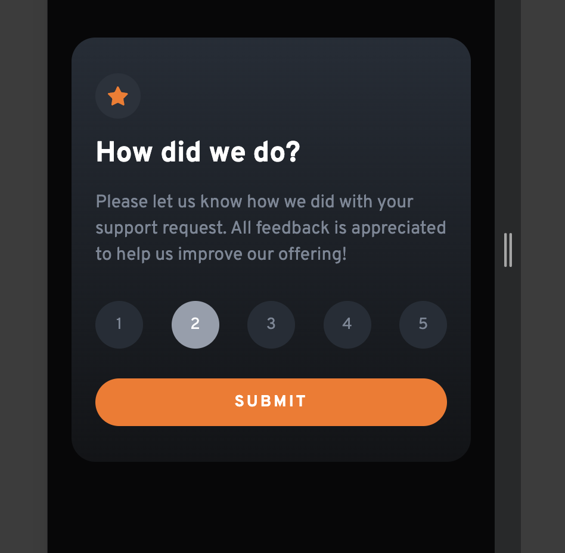
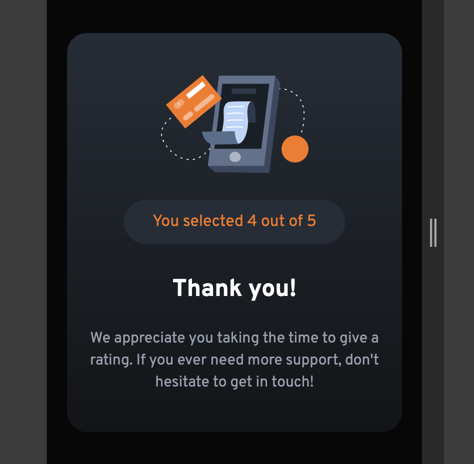
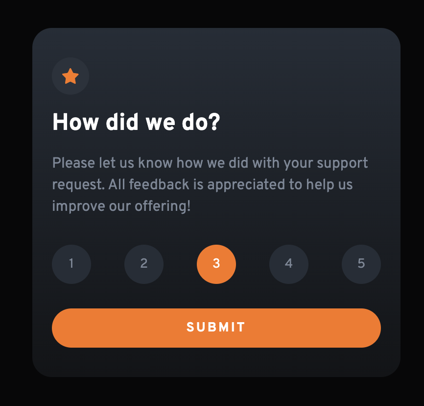
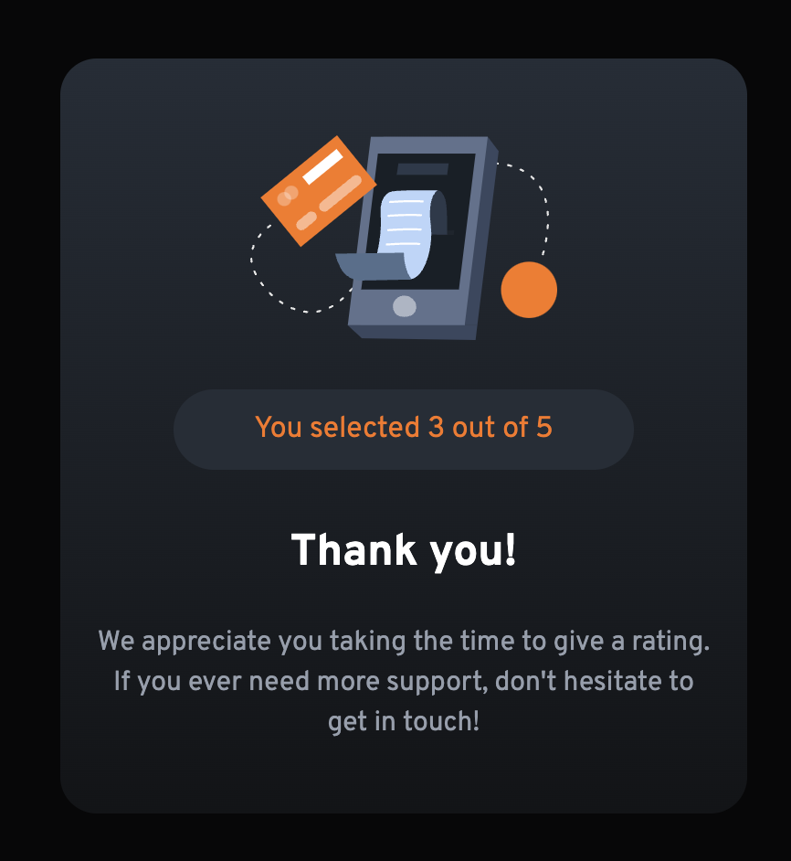

# Frontend Mentor - Interactive rating component solution

This is a solution to the [Interactive rating Component on Frontend Mentor](https://www.frontendmentor.io/challenges/interactive-rating-component-koxpeBUmI). Frontend Mentor challenges help you improve your coding skills by building realistic projects. 

## Table of contents

- [Overview](#overview)
  - [The challenge](#the-challenge)
  - [Screenshot](#screenshot)
  - [Links](#links)
- [My process](#my-process)
  - [Built with](#built-with)
  - [What I learned](#what-i-learned)
- [Author](#author)
- [Acknowledgments](#acknowledgments)

## Overview

### The challenge

Users should be able to:

- View the optimal layout depending on their device's screen size
- See hover and focus states for interactive elements

### Screenshot

 

 
 

### Links

<!-- - Live Site URL: [Netlify](https://prod-prev-fem-challenge.netlify.app/) -->

## My process

### Built with

- CSS custom properties width modules
- Flexbox
- Mobile-first workflow
- Vite | Typescript + SWR

### What I learned

"I undertook this project to start working with TypeScript and not end up struggling while trying to do something big. It's always better to start small, to pave the way gradually, rather than banging your head against the wall."

## Author

- Website - [Rodrigo M. Ponce || Rocko P11](https://www.linkedin.com/in/rodrigo-m-ponce/)
- Frontend Mentor - [@rockop11](https://www.frontendmentor.io/profile/rockop11)